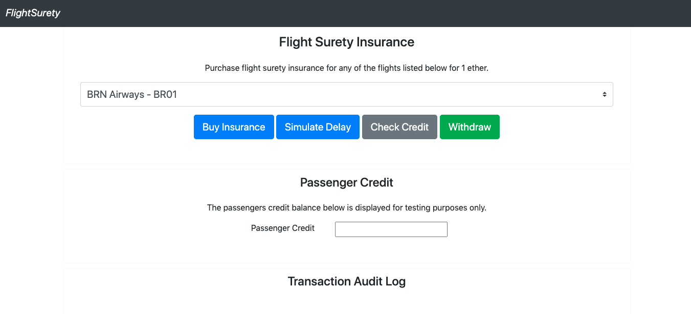

# FlightSurety

FlightSurety is a sample application project for Udacity's Blockchain course.

## Project Details

-   Truffle v5.1.49 (core: 5.1.49)
-   Solidity v0.5.16 (solc-js)
-   Node v14.9.0
-   Web3.js v1.2.1

## Run Instructions

**Installing**
-   npm install
-   npm install @babel/plugin-proposal-class-properties --save-dev

**Truffle**
-   truffle develop
-   compile
-   migrate --reset
-   test

**Running**
-   npm run server
-   npm run dapp

## Demo running

```truffle develop```

```> compile```
```> test```

**Contract: Flight Surety App Tests**
```
✓ fundAirline: Makes sure that an airline pays sufficient funds (83ms)
    ✓ fundAirline: Makes sure that an airline is registered before paying funds (112ms)
    ✓ fundAirline: Makes sure that a registered airline within sufficient funds has its funded status updated (208ms)
    ✓ registerAirline: Makes sure an unregistered airline cannot register another airline (135ms)
    ✓ registerAirline: A registered airline can register another founding airline (757ms)
    ✓ registerAirline: Makes sure an airline can only be registered once (149ms)
    ✓ registerAirline: Makes sure multi-party consensus is used for registering an airline once more than 4 airlines are registered (284ms)
    ✓ registerFlight: Makes sure an unregistered airline cannot register a flight (153ms)
    ✓ registerFlight: A registered airline can register a new flight (254ms)
    ✓ buy: Makes sure the correct payment amount is provided (143ms)
    ✓ buy: Makes sure the flight has been registered (80ms)
    ✓ buy: Makes sure a new passenger for a flight can purchase insurance (122ms)
    ✓ buy: Makes sure an existing passenger for a flight cannot purchase another insurance policy (113ms)
    ✓ withdraw: Makes sure a passenger can withdraw their credit (167ms)
```

**Contract: Flight Surety Data Tests**
```
✓ isOperational: Contract is operational on initialisation
    ✓ setOperatingStatus: Only contract owner can pause the contract (87ms)
    ✓ setOperatingStatus: Contract owner can pause the contract (136ms)
    ✓ authorizeCaller: Contract owner can assign access to data contract (49ms)
    ✓ authorizeCaller: Only contract owner can assign access to data contract (41ms)
    ✓ deauthorizeCaller: Contract owner can remove access to data contract (55ms)
    ✓ deauthorizeCaller: Only contract owner can remove access to data contract (46ms)
    ✓ deauthorizeCaller: Contract owner cannot remove their access to data contract (52ms)
    ✓ getNumberOfAirlines: Automatic registration of first airline
    ✓ getAirline: Automatic registration of first airline
    ✓ registerAirline: Access is blocked whenever contract is paused (149ms)
    ✓ registerAirline: Access is blocked to non-registered contracts (117ms)
    ✓ registerAirline: Multiple unique airlines can be registered (413ms)
    ✓ updateAirlineFunding: An airline's funding can be recorded (151ms)
    ✓ updateAirlineFunding: An airline's who's funding has already been recorded does not update the number of funded airlines tally. (128ms)
    ✓ registerFlight: Access is blocked whenever contract is paused (146ms)
    ✓ registerFlight: Access is blocked to non-registered contracts (192ms)
    ✓ registerFlight: Multiple unique flights can be registered (823ms)
    ✓ buy: Purchase an insurance policy (124ms)
    ✓ creditInsurees: An insured passenger should be credited when a flight is delayed (127ms)
    ✓ creditInsurees: Ensure credited passengers cannot receive credit more than once. (95ms)
    ✓ pay: Purchase an insurance policy (119ms)
```

## Screen



## Using the DAPP

http://localhost:8000

1. Select a flight.
2. Buy insurance.
3. Simulate a flight delay - Continue until you see a status greater than 10 in the oracle server terminal.
4. Check the credit balance for the passenger, to ensure the flight delay caused credit to be allocated to the passenger.
5. Withdraw the funds.
6. Check the credit balance for the passenger, to ensure the credit balance has been zeroed out.

The transaction audit log will show the result of the transactions being made.
